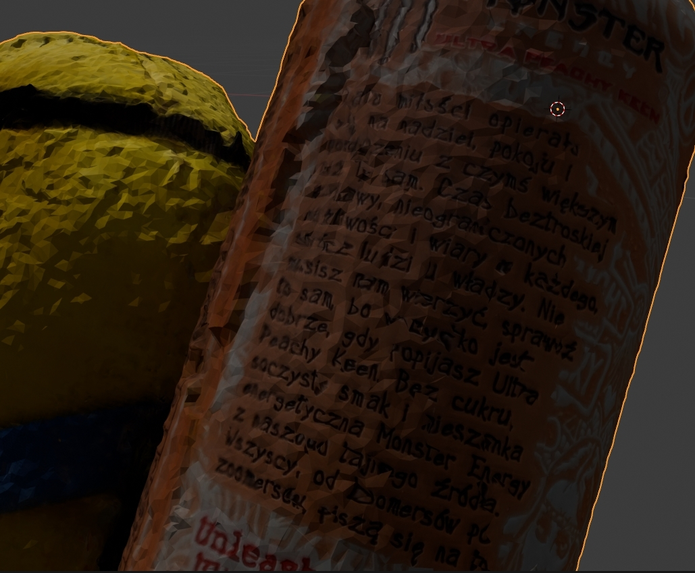
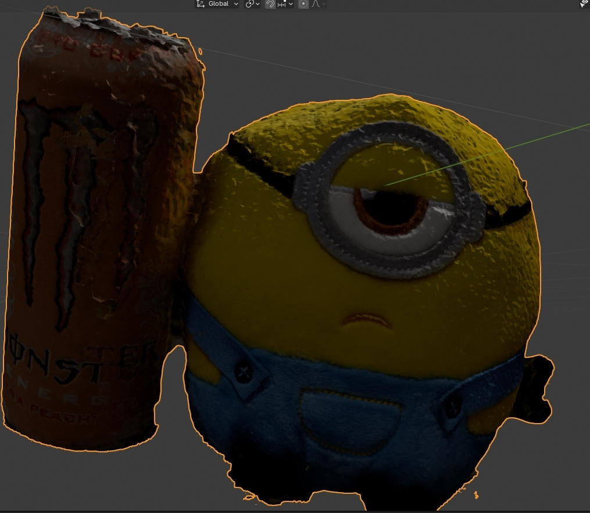

# Fotorealistyczny model przy użyciu Meshroom + Blender
Do zrobienia modelu użyłem 58 zdjęć

## Kilka z użytych zdjęć
.jpg)
.jpg)
.jpg)
.jpg)
.jpg)
## Kilka close-upów (gif jest niestety niskiej jakości)

## Krótki film z blendera

